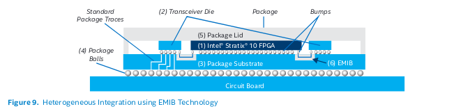

# Intel's 3D SiP technology 

This technology enables next-generation platforms by offering : 
- higher bandwidth
- lower power
- a smaller form factor
-  increased functionality and flexibility

## Challenges Intel has identified for the futur

Inovation in this field is motivated according to Intel because current packaging technologies have hit there limit regarding : 
- Chip-to-chip bandwidth limited by the interconnect density permitted by underlying PCB. 
- System power is too high due to the need to drive long PCB traces between components.
- Form factor is too big due to the number of discrete components required for the desired system functionality

# Embedded Multi-die Interconnect Bridge (EMIB)

## Flexibility 

Heterogeneous 3D SiP technology decouples the transceiver 
tile or die from the core fabric die: the transceiver is separate 
and sits next to the core fabric die. Therefore, the transceiver 
and core fabric die do not have to be manufactured on 
the same process node. 

> Maturation issues for technologies; no guaranty that the required IP exists in the 
desired processor node. eg : CPU in 7nm but SRAM in 16 nm.

The heterogeneous 3D SiP technology allows Intel to mix 
components to match system requirements, effectively 
providing robust solutions more quickly than in previous 
generations. 

> Re-usability of solutions: no longer needed to re-design the chip layout around the 
desired IPs, can create a semi-standard package to be integrated into futur stacking. 
:warning: No information regarding the emersion or exisitance of any indistry level 
standards were mentioned in this article so we have to assume that this compatibility 
between designs only exists within Intel s IP s selection.

## Pacakge construction 

According to Intel s example a chip using this new technology could look like :

### Example 
The construction heterogeneously integrates the FPGA fabric die (1) and two transceiver die (2). (The non-
FPGA die can be a transceiver die, memory die, CPU die, or any other functionality.) The three die rest on a standard 
flip-chip ball grid array (FCBGA) package substrate (3), which 
connects to the underlying PCB. The routing between the 
die and the package balls uses standard FCBGA routing (4). 
This assembly is encapsulated with a standard package lid 
(5) to create a single package solution. The package substrate 
utilizes several EMIB connections (6). 

### Why is this solution supperior ( according to Intel )

the EMIB is a small silicon chip 
embedded in the underlying package substrate and offers 
dedicated ultra-high-density interconnect between die. 
Importantly, the EMIB physical dimensions do not limit the 
number of die that can be integrated. In contrast, alternative 
implementations use a large piece of silicon interposer that 
sits on top of the package substrate and exceeds the entire 
length of the die to be integrated. The large piece of silicon 
interposer makes the solution cost prohibitive and prone 
to issues such as warpage, etc. Alternative solutions also 
require a large number of micro bumps using micro vias, 
which affects the overall yield and manufacturing complexity. 
Additionally, the number of die that can be integrated using 
an interposer is limited, affecting the scalability.

## Sources 

https://www.intel.com/content/dam/www/programmable/us/en/pdfs/literature/wp/wp-01251-enabling-nextgen-with-3d-system-in-package.pdf
https://fuse.wikichip.org/news/1910/intel-looks-to-advanced-3d-packaging-for-more-than-moore-to-supplement-10-and-7-nanometer-nodes/
